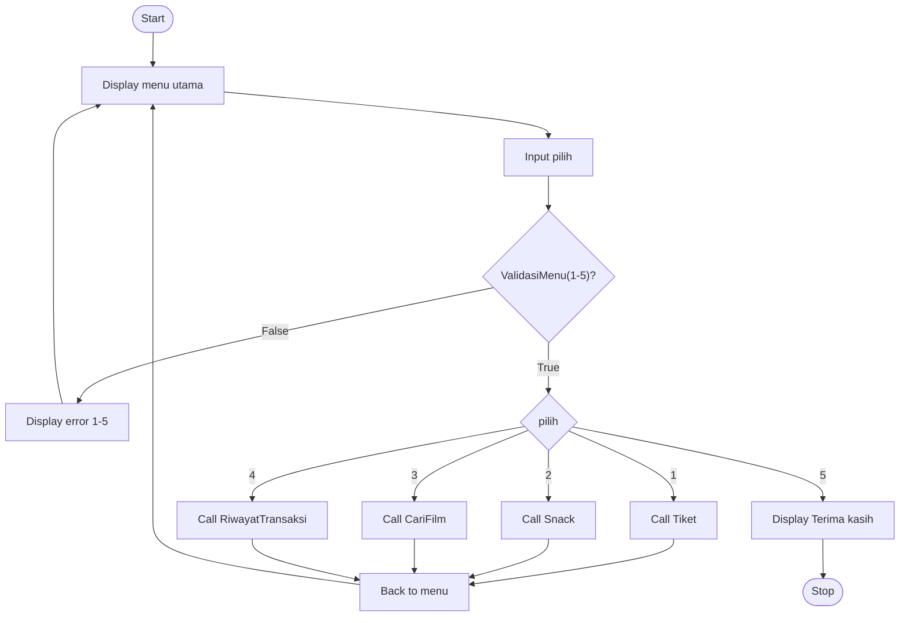
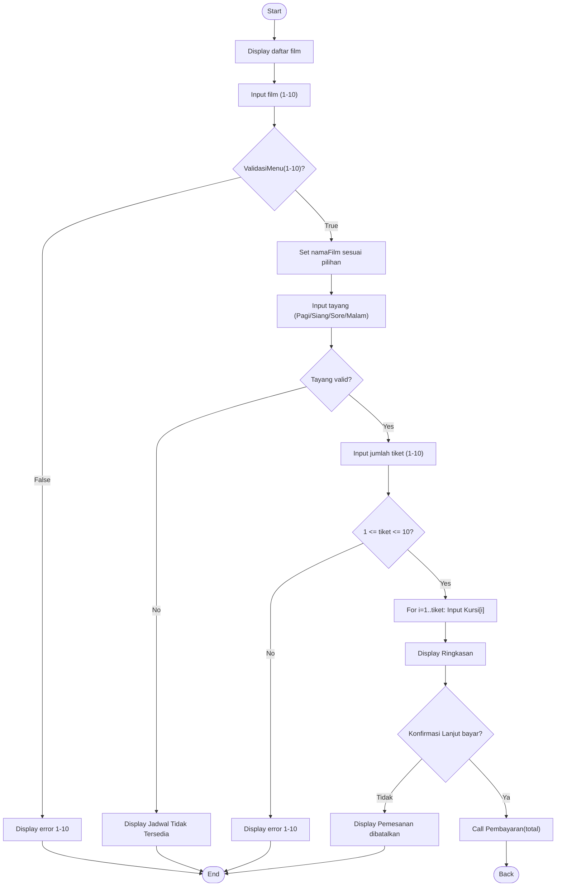
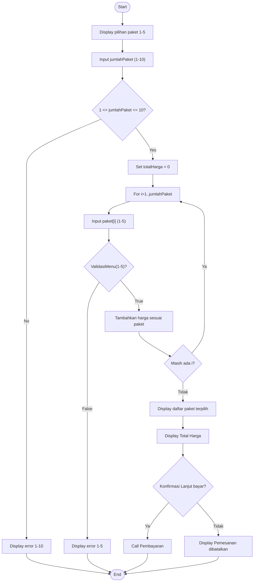
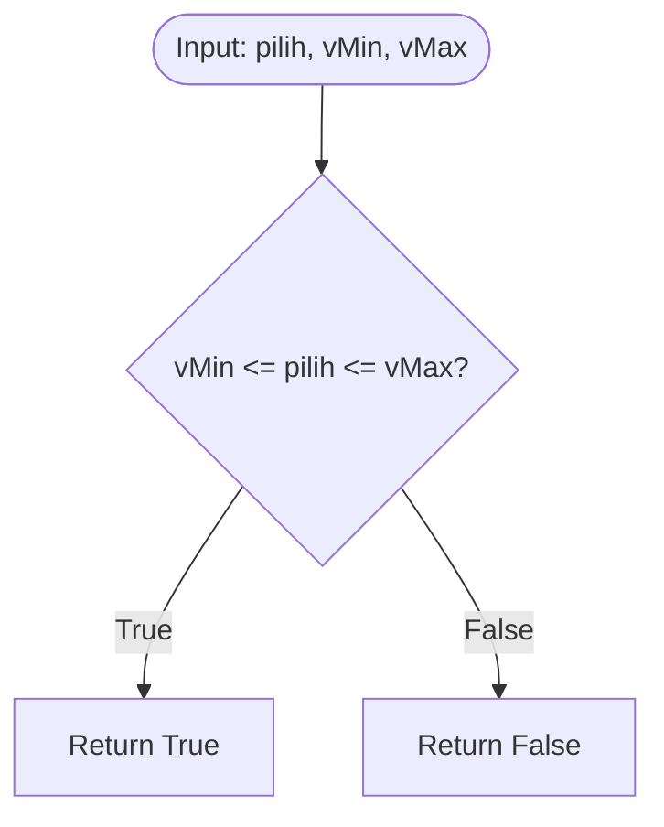
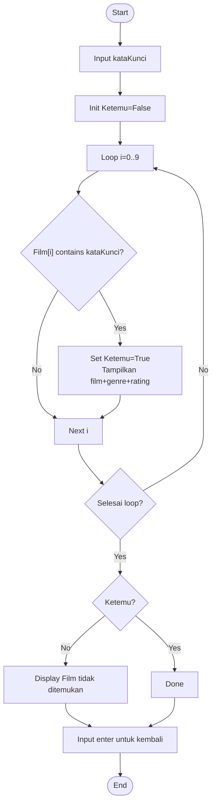
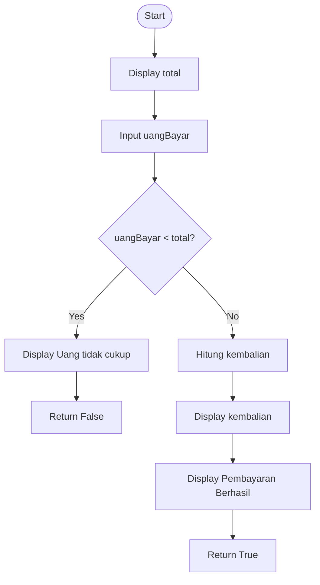
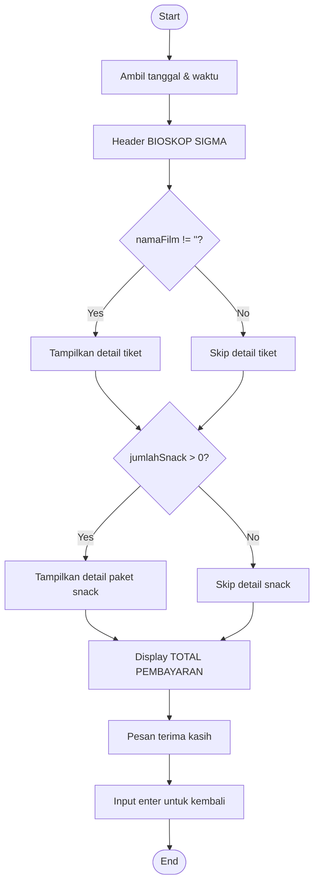
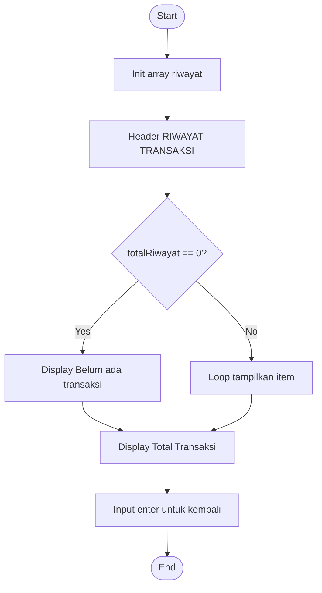

# Flowcharts Sistem Reservasi Bioskop (Fixed)

## Main

```mermaid
flowchart TD
    A([Start]) --> B[Display menu utama]
    B --> C[Input pilih]
    C --> D{"ValidasiMenu(1-5)?"}
    D -- False --> E[Display error 1-5]
    E --> B
    D -- True --> F{pilih}
    F -- 1 --> G[Call Tiket]
    F -- 2 --> H[Call Snack]
    F -- 3 --> I[Call CariFilm]
    F -- 4 --> J[Call RiwayatTransaksi]
    F -- 5 --> K[Display Terima kasih]
    G --> L[Back to menu]
    H --> L
    I --> L
    J --> L
    L --> B
    K --> Z([Stop])
```

---

## Tiket

```mermaid
flowchart TD
    A([Start]) --> B[Display daftar film]
    B --> C["Input film (1-10)"]
    C --> D{"ValidasiMenu(1-10)?"}
    D -- False --> E[Display error 1-10]
    E --> Z([End])
    D -- True --> F[Set namaFilm sesuai pilihan]
    F --> G["Input tayang (Pagi/Siang/Sore/Malam)"]
    G --> H{Tayang valid?}
    H -- No --> I[Display Jadwal Tidak Tersedia]
    I --> Z
    H -- Yes --> J["Input jumlah tiket (1-10)"]
    J --> K{"1 <= tiket <= 10?"}
    K -- No --> L[Display error 1-10]
    L --> Z
    K -- Yes --> M["For i=1..tiket: Input Kursi[i]"]
    M --> N[Display Ringkasan]
    N --> O{Konfirmasi Lanjut bayar?}
    O -- Ya --> P["Call Pembayaran(total)"]
    P --> Q([Back])
    O -- Tidak --> R[Display Pemesanan dibatalkan]
    R --> Z
```

---

## Snack

```mermaid
flowchart TD
    A([Start]) --> B[Display pilihan paket 1-5]
    B --> C["Input jumlahPaket (1-10)"]
    C --> D{"1 <= jumlahPaket <= 10?"}
    D -- No --> E[Display error 1-10]
    E --> Z([End])
    D -- Yes --> F[Set totalHarga = 0]
    F --> G[For i=1..jumlahPaket]
    G --> H["Input paket[i] (1-5)"]
    H --> I{"ValidasiMenu(1-5)?"}
    I -- False --> J[Display error 1-5]
    J --> Z
    I -- True --> K[Tambahkan harga sesuai paket]
    K --> L{Masih ada i?}
    L -- Ya --> G
    L -- Tidak --> M[Display daftar paket terpilih]
    M --> N[Display Total Harga]
    N --> O{Konfirmasi Lanjut bayar?}
    O -- Ya --> P[Call Pembayaran]
    O -- Tidak --> Q[Display Pemesanan dibatalkan]
    P --> Z
    Q --> Z
```

---

## ValidasiMenu

```mermaid
flowchart TD
    A(["Input: pilih, vMin, vMax"]) --> B{"vMin <= pilih <= vMax?"}
    B -- True --> C[Return True]
    B -- False --> D[Return False]
```

---

## CariFilm

```mermaid
flowchart TD
    A([Start]) --> B[Input kataKunci]
    B --> C[Init Ketemu=False]
    C --> D[Loop i=0..9]
    D --> E{"Film[i] contains kataKunci?"}
    E -- Yes --> F["Set Ketemu=True<br/>Tampilkan film+genre+rating"]
    E -- No --> G[Next i]
    F --> G
    G --> H{Selesai loop?}
    H -- No --> D
    H -- Yes --> I{Ketemu?}
    I -- No --> J[Display Film tidak ditemukan]
    I -- Yes --> K[Done]
    J --> L[Input enter untuk kembali]
    K --> L
    L --> Z([End])
```

---

## Pembayaran

```mermaid
flowchart TD
    A([Start]) --> B[Display total]
    B --> C[Input uangBayar]
    C --> D{"uangBayar < total?"}
    D -- Yes --> E[Display Uang tidak cukup]
    E --> F[Return False]
    D -- No --> G[Hitung kembalian]
    G --> H[Display kembalian]
    H --> I[Display Pembayaran Berhasil]
    I --> J[Return True]
```

---

## Struk

```mermaid
flowchart TD
    A([Start]) --> B[Ambil tanggal & waktu]
    B --> C[Header BIOSKOP SIGMA]
    C --> D{"namaFilm != ''?"}
    D -- Yes --> E[Tampilkan detail tiket]
    D -- No --> F[Skip detail tiket]
    E --> G{jumlahSnack > 0?}
    F --> G
    G -- Yes --> I[Tampilkan detail paket snack]
    G -- No --> J[Skip detail snack]
    I --> K[Display TOTAL PEMBAYARAN]
    J --> K
    K --> L[Pesan terima kasih]
    L --> M[Input enter untuk kembali]
    M --> Z([End])
```

---

## RiwayatTransaksi

```mermaid
flowchart TD
    A([Start]) --> B[Init array riwayat]
    B --> C[Header RIWAYAT TRANSAKSI]
    C --> D{"totalRiwayat == 0?"}
    D -- Yes --> E[Display Belum ada transaksi]
    D -- No --> F[Loop tampilkan item]
    E --> G[Display Total Transaksi]
    F --> G
    G --> H[Input enter untuk kembali]
    H --> Z([End])
```